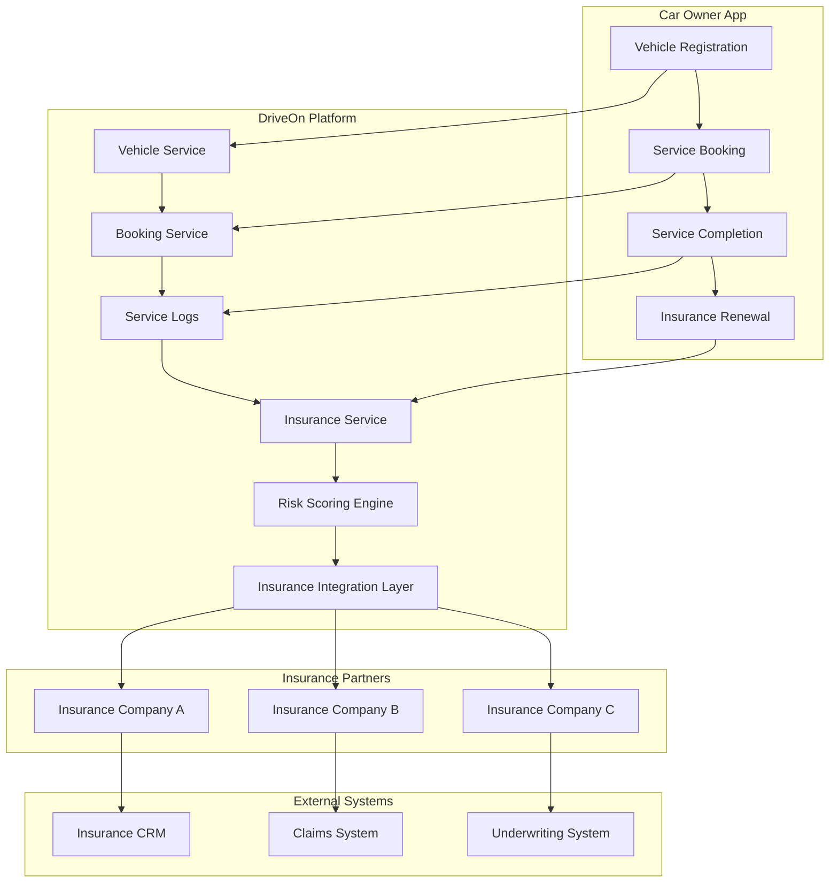

# 🚗 Insurance Integration Analysis - DriveOn Platform

## 📊 Current Backend Architecture Analysis

### **🏗️ Service Architecture Overview**

```
┌─────────────────────────────────────────────────────────────────┐
│                        DriveOn Platform                        │
├─────────────────────────────────────────────────────────────────┤
│  Frontend (Flutter)  ←→  API Gateway (Nginx)  ←→  Backend Services │
└─────────────────────────────────────────────────────────────────┘

Backend Services:
├── user-service (Port 8001)      - Authentication & User Management
├── vehicle-service (Port 8002)   - Vehicle Data & Management  
├── service-provider (Port 8003)  - Provider & Service Management
├── booking-service (Port 8004)   - Booking & Service Logs
├── insurance-service (Port 8005) - Insurance Policy Management
└── expenses-service              - Financial Tracking
```

### **📋 Current Data Models Analysis**

#### **1. Vehicle Service (`vehicle_service`)**
```sql
-- Schema: vehicles
CREATE TABLE vehicles (
    id VARCHAR PRIMARY KEY,
    owner_id INTEGER,                    -- Links to user-service
    make VARCHAR,
    model VARCHAR,
    plate VARCHAR UNIQUE,
    mileage INTEGER DEFAULT 0,           -- 🔑 Key for insurance risk
    yom INTEGER,                         -- Year of Manufacture
    fuel_type VARCHAR,
    transmission VARCHAR,
    color VARCHAR,
    -- Guest vehicle support
    guest_owner_name VARCHAR,
    guest_owner_email VARCHAR,
    guest_owner_phone VARCHAR,
    created_by_provider_id VARCHAR
);
```

**🔍 Insurance Integration Potential:**
- ✅ **Mileage tracking** - Critical for usage-based insurance
- ✅ **Vehicle specifications** - Risk assessment data
- ✅ **Owner linking** - Policy holder identification
- ⚠️ **Missing**: VIN, engine size, safety features, accident history

#### **2. Booking Service (`booking_service`)**
```sql
-- Schema: bookings
CREATE TABLE bookings (
    id VARCHAR PRIMARY KEY,
    user_id INTEGER,                     -- Links to user-service
    vehicle_id VARCHAR,                  -- Links to vehicle-service
    provider_id VARCHAR,                 -- Links to service-provider
    service_id VARCHAR,
    status VARCHAR DEFAULT 'pending',
    scheduled_at TIMESTAMP,
    location JSON,                       -- Geo-tagged service location
    meta JSON,                           -- Service-specific data
    created_at TIMESTAMP
);

-- Schema: bookings  
CREATE TABLE service_logs (
    id VARCHAR PRIMARY KEY,
    user_id INTEGER,
    vehicle_id VARCHAR,
    provider_id VARCHAR,
    service_id VARCHAR,
    service_name VARCHAR,
    service_items JSON,                  -- 🔑 Detailed service history
    mileage_km INTEGER,                  -- 🔑 Mileage at service
    performed_at TIMESTAMP,
    next_service_km INTEGER,             -- 🔑 Maintenance schedule
    next_service_date TIMESTAMP,
    served_by VARCHAR,
    cost INTEGER,                        -- 🔑 Service cost data
    logged_by VARCHAR DEFAULT 'user',    -- user/provider/system
    notes VARCHAR,
    created_at TIMESTAMP
);
```

**🔍 Insurance Integration Potential:**
- ✅ **Service history** - Maintenance compliance tracking
- ✅ **Mileage progression** - Usage pattern analysis
- ✅ **Service costs** - Claim validation data
- ✅ **Provider verification** - Trusted service network
- ⚠️ **Missing**: Service quality ratings, warranty tracking, recall management

#### **3. Insurance Service (`insurance_service`)**
```sql
-- Schema: insurance
CREATE TABLE insurance_policies (
    id VARCHAR PRIMARY KEY,
    owner_id INTEGER,                    -- Links to user-service
    vehicle_id VARCHAR,                  -- Links to vehicle-service
    provider_id VARCHAR,                 -- Insurance company ID
    insurance_type VARCHAR,              -- Comprehensive, Third-party, etc.
    commencement_date TIMESTAMP,
    expiry_date TIMESTAMP,               -- 🔑 Renewal triggers
    created_at TIMESTAMP
);
```

**🔍 Current Limitations:**
- ❌ **No premium tracking** - Missing cost data
- ❌ **No claim management** - No claims table
- ❌ **No risk scoring** - No risk assessment data
- ❌ **No policy details** - Missing coverage specifics

---

## 🏦 Insurance Integration Architecture

### **📡 Data Flow Architecture**



### **🔌 API Integration Layer Design**

#### **1. Insurance Partner APIs**
```python
# New Service: insurance-integration-service (Port 8006)
class InsuranceIntegrationService:
    """Handles all insurance partner integrations"""
    
    # Partner Management
    async def register_insurance_partner(partner_data)
    async def get_partner_policies(partner_id)
    async def sync_policy_data(partner_id)
    
    # Real-time Data Feeds
    async def send_vehicle_data_feed(vehicle_id, data_type)
    async def send_service_completion_event(service_log_id)
    async def send_risk_score_update(vehicle_id, new_score)
    
    # Claims Management
    async def initiate_claim(claim_data)
    async def submit_claim_evidence(claim_id, evidence)
    async def track_claim_status(claim_id)
    
    # Policy Management
    async def get_quotes(vehicle_id, coverage_type)
    async def create_policy(policy_data)
    async def renew_policy(policy_id)
    async def cancel_policy(policy_id)
```

#### **2. Risk Scoring Engine**
```python
# New Service: risk-scoring-service (Port 8007)
class RiskScoringEngine:
    """Calculates vehicle and driver risk scores"""
    
    def calculate_vehicle_risk_score(vehicle_id):
        """Based on: age, mileage, service history, accident history"""
        
    def calculate_driver_risk_score(user_id):
        """Based on: service punctuality, driving behavior, claims history"""
        
    def calculate_combined_risk_score(vehicle_id, user_id):
        """Weighted combination of vehicle and driver scores"""
        
    def update_risk_factors(vehicle_id, new_data):
        """Real-time risk factor updates"""
```

---

## 🚀 Development Plan

### **Phase 1: Foundation (Months 1-2)**

#### **1.1 Enhanced Insurance Service**
```python
# Extend insurance_service/models/insurance.py
class Insurance_Policy(Base):
    # ... existing fields ...
    premium_amount = Column(Integer, nullable=True)
    coverage_details = Column(JSON, nullable=True)
    deductible_amount = Column(Integer, nullable=True)
    policy_number = Column(String, unique=True, index=True)
    status = Column(String, default="active")  # active, expired, cancelled
    renewal_reminder_sent = Column(Boolean, default=False)

class Insurance_Claim(Base):
    __tablename__ = "insurance_claims"
    __table_args__ = {"schema": "insurance"}
    
    id = Column(String, primary_key=True, default=lambda: str(uuid.uuid4()))
    policy_id = Column(String, ForeignKey("insurance.insurance_policies.id"))
    vehicle_id = Column(String, index=True)
    user_id = Column(Integer, index=True)
    claim_type = Column(String)  # accident, breakdown, theft, etc.
    incident_date = Column(TIMESTAMP(timezone=True))
    description = Column(String)
    estimated_cost = Column(Integer, nullable=True)
    status = Column(String, default="submitted")  # submitted, approved, rejected, paid
    evidence_files = Column(JSON, nullable=True)  # photos, documents
    created_at = Column(TIMESTAMP(timezone=True), server_default=func.now())

class Risk_Score(Base):
    __tablename__ = "risk_scores"
    __table_args__ = {"schema": "insurance"}
    
    id = Column(String, primary_key=True, default=lambda: str(uuid.uuid4()))
    vehicle_id = Column(String, index=True)
    user_id = Column(Integer, index=True)
    vehicle_risk_score = Column(Integer)  # 0-100
    driver_risk_score = Column(Integer)   # 0-100
    combined_risk_score = Column(Integer) # 0-100
    risk_factors = Column(JSON, nullable=True)
    last_updated = Column(TIMESTAMP(timezone=True), server_default=func.now())
```

#### **1.2 Insurance Integration Service**
```python
# New service: insurance-integration-service
class InsuranceIntegrationService:
    def __init__(self):
        self.partners = {}  # Registered insurance partners
        
    async def register_partner(self, partner_config):
        """Register new insurance partner"""
        
    async def send_vehicle_data_feed(self, vehicle_id, partner_id):
        """Send vehicle data to insurance partner"""
        
    async def handle_claim_submission(self, claim_data):
        """Process claim submission to partner"""
```

### **Phase 2: Core Features (Months 3-4)**

#### **2.1 Risk Scoring Implementation**
```python
# risk-scoring-service/main.py
class RiskScoringEngine:
    def calculate_vehicle_risk(self, vehicle_id):
        vehicle = get_vehicle(vehicle_id)
        service_logs = get_service_logs(vehicle_id)
        
        # Age factor (0-30 points)
        age_score = min(30, (2024 - vehicle.yom) * 2)
        
        # Mileage factor (0-25 points)
        mileage_score = min(25, vehicle.mileage / 1000)
        
        # Service history factor (0-25 points)
        service_score = self._calculate_service_score(service_logs)
        
        # Accident history factor (0-20 points)
        accident_score = self._calculate_accident_score(vehicle_id)
        
        return 100 - (age_score + mileage_score + service_score + accident_score)
    
    def _calculate_service_score(self, service_logs):
        """Calculate service compliance score"""
        # Logic for service punctuality, quality, etc.
        pass
```

#### **2.2 Claims Management System**
```python
# insurance-service/routes/claims.py
@router.post("/claims/submit")
async def submit_claim(claim_data: ClaimCreate, db: Session = Depends(get_db)):
    """Submit new insurance claim"""
    
    # Create claim record
    claim = Insurance_Claim(**claim_data.dict())
    db.add(claim)
    db.commit()
    
    # Notify insurance partner
    await insurance_integration.send_claim_notification(claim.id)
    
    # Update risk score
    await risk_scoring.update_claim_risk(claim.vehicle_id)
    
    return claim

@router.post("/claims/{claim_id}/evidence")
async def upload_claim_evidence(claim_id: str, files: List[UploadFile]):
    """Upload evidence for claim"""
    # Handle file uploads, store in cloud storage
    # Update claim with evidence URLs
    pass
```

### **Phase 3: Advanced Features (Months 5-6)**

#### **3.1 Insurance Marketplace**
```python
# insurance-service/routes/marketplace.py
@router.get("/marketplace/quotes")
async def get_insurance_quotes(vehicle_id: str, coverage_type: str):
    """Get quotes from multiple insurance partners"""
    
    vehicle_data = await get_vehicle_data(vehicle_id)
    risk_score = await get_risk_score(vehicle_id)
    
    quotes = []
    for partner in active_partners:
        quote = await partner.get_quote(vehicle_data, risk_score, coverage_type)
        quotes.append(quote)
    
    return sorted(quotes, key=lambda x: x['premium'])

@router.post("/marketplace/purchase")
async def purchase_policy(quote_id: str, payment_data: PaymentData):
    """Purchase insurance policy"""
    
    # Process payment
    payment_result = await process_payment(payment_data)
    
    if payment_result.success:
        # Create policy
        policy = await create_policy_from_quote(quote_id)
        
        # Notify partner
        await notify_partner_policy_created(policy.id)
        
        return policy
```

#### **3.2 Real-time Data Feeds**
```python
# insurance-integration-service/feeds.py
class DataFeedManager:
    async def send_service_completion_feed(self, service_log_id):
        """Send service completion data to all relevant partners"""
        
        service_log = await get_service_log(service_log_id)
        vehicle_id = service_log.vehicle_id
        
        # Get all policies for this vehicle
        policies = await get_vehicle_policies(vehicle_id)
        
        for policy in policies:
            partner = await get_partner(policy.provider_id)
            
            feed_data = {
                'vehicle_id': vehicle_id,
                'service_type': service_log.service_name,
                'service_date': service_log.performed_at,
                'mileage': service_log.mileage_km,
                'cost': service_log.cost,
                'provider': service_log.provider_name,
                'next_service_due': service_log.next_service_date
            }
            
            await partner.send_data_feed(feed_data)
```

---

## 🎯 Features Roadmap

### **🚀 MVP Features (Months 1-3)**

#### **Core Insurance Management**
- ✅ **Policy Registration** - Link existing policies to vehicles
- ✅ **Policy Renewal Reminders** - Automated expiry notifications
- ✅ **Basic Claims Submission** - Simple claim filing with photos
- ✅ **Vehicle Risk Scoring** - Basic risk assessment based on vehicle data

#### **Data Integration**
- ✅ **Service History Feed** - Send service logs to insurance partners
- ✅ **Mileage Tracking** - Real-time mileage updates
- ✅ **Basic Analytics** - Simple risk and usage reports

### **📈 Advanced Features (Months 4-6)**

#### **Insurance Marketplace**
- 🔄 **Multi-Provider Quotes** - Compare quotes from multiple insurers
- 🔄 **Instant Policy Purchase** - Buy policies directly in app
- 🔄 **Policy Management** - Update, renew, cancel policies
- 🔄 **Payment Integration** - Mobile money and card payments

#### **Advanced Risk Management**
- 🔄 **Driver Behavior Scoring** - Based on service punctuality and patterns
- 🔄 **Predictive Analytics** - ML-based risk prediction
- 🔄 **Usage-Based Insurance** - Pay-per-mile or pay-per-use models
- 🔄 **Fraud Detection** - AI-powered claim validation

### **🚀 Premium Features (Months 7-12)**

#### **AI-Powered Features**
- 🔮 **Smart Claim Processing** - Automated claim assessment
- 🔮 **Predictive Maintenance** - AI-driven service recommendations
- 🔮 **Accident Detection** - Automatic accident reporting via sensors
- 🔮 **Personalized Insurance** - Dynamic pricing based on behavior

#### **Enterprise Features**
- 🔮 **Insurance Partner Dashboard** - Comprehensive analytics portal
- 🔮 **API Marketplace** - Third-party integrations
- 🔮 **White-label Solutions** - Custom insurance platforms
- 🔮 **Blockchain Integration** - Immutable service and claim records

---

## 💰 Monetization Model

### **💵 Revenue Streams**

#### **1. Commission-Based Revenue (Primary)**
```
Insurance Policy Sales: 5-15% commission per policy
├── New Policy Sales: 10-15% commission
├── Policy Renewals: 5-10% commission  
├── Policy Upgrades: 8-12% commission
└── Add-on Services: 15-25% commission
```

**Example Calculation:**
- Average policy value: $500/year
- Commission rate: 10%
- Revenue per policy: $50/year
- 1,000 active policies = $50,000/year

#### **2. Data Licensing (Secondary)**
```
Risk Data Licensing: $0.10 - $1.00 per data point
├── Vehicle Risk Scores: $0.50 per score
├── Service History Data: $0.25 per record
├── Usage Analytics: $0.10 per data point
└── Predictive Insights: $1.00 per insight
```

**Example Calculation:**
- 10,000 vehicles × 12 monthly risk scores = 120,000 scores/year
- 120,000 × $0.50 = $60,000/year from risk data alone

#### **3. Subscription Revenue (Tertiary)**
```
Insurance Partner Subscriptions: $500 - $5,000/month
├── Basic Plan: $500/month (up to 1,000 policies)
├── Professional Plan: $2,000/month (up to 10,000 policies)
├── Enterprise Plan: $5,000/month (unlimited policies)
└── Custom Solutions: $10,000+/month
```

#### **4. Transaction Fees**
```
Payment Processing: 2-3% per transaction
├── Policy Payments: 2.5% per payment
├── Claim Payouts: 2% per payout
└── Service Payments: 3% per payment
```

### **📊 Revenue Projections**

#### **Year 1 Targets**
```
Users: 5,000 active users
Policies: 2,000 active policies
Partners: 5 insurance companies

Revenue Breakdown:
├── Commission Revenue: $100,000 (2,000 policies × $50 avg)
├── Data Licensing: $30,000 (risk scores + analytics)
├── Subscriptions: $60,000 (5 partners × $1,000 avg/month)
└── Transaction Fees: $15,000 (payment processing)

Total Year 1 Revenue: $205,000
```

#### **Year 3 Targets**
```
Users: 50,000 active users
Policies: 25,000 active policies
Partners: 15 insurance companies

Revenue Breakdown:
├── Commission Revenue: $1,250,000 (25,000 policies × $50 avg)
├── Data Licensing: $500,000 (expanded data products)
├── Subscriptions: $360,000 (15 partners × $2,000 avg/month)
├── Transaction Fees: $200,000 (increased transaction volume)
└── Premium Features: $300,000 (AI features, enterprise solutions)

Total Year 3 Revenue: $2,610,000
```

### **🎯 Key Success Metrics**

#### **User Engagement**
- **Policy Attachment Rate**: % of vehicles with active insurance policies
- **Service Completion Rate**: % of services completed through platform
- **Claim Submission Rate**: % of incidents reported through platform
- **Renewal Rate**: % of policies renewed through platform

#### **Partner Satisfaction**
- **Partner Retention Rate**: % of insurance partners retained annually
- **Data Quality Score**: Accuracy and completeness of data feeds
- **API Usage**: Number of API calls per partner per month
- **Revenue per Partner**: Average revenue generated per insurance partner

#### **Platform Performance**
- **Risk Score Accuracy**: Correlation between risk scores and actual claims
- **Claim Processing Time**: Average time from submission to resolution
- **Data Feed Latency**: Time from service completion to partner notification
- **System Uptime**: Platform availability percentage

---

## 🔧 Technical Implementation Priorities

### **Immediate (Next 30 Days)**
1. **Extend Insurance Models** - Add premium, claims, and risk score tables
2. **Create Risk Scoring Service** - Basic vehicle risk calculation
3. **Implement Claims API** - Basic claim submission and tracking
4. **Add Policy Renewal Logic** - Automated expiry notifications

### **Short-term (Next 90 Days)**
1. **Insurance Integration Service** - Partner API management
2. **Data Feed System** - Real-time service data sharing
3. **Insurance Marketplace** - Multi-provider quote comparison
4. **Payment Integration** - Policy purchase and renewal payments

### **Medium-term (Next 180 Days)**
1. **Advanced Risk Scoring** - Driver behavior and predictive analytics
2. **AI Claim Processing** - Automated claim assessment
3. **Partner Dashboard** - Comprehensive analytics portal
4. **Mobile App Integration** - Full insurance features in Flutter app

### **Long-term (Next 365 Days)**
1. **Blockchain Integration** - Immutable service and claim records
2. **IoT Integration** - Telematics and sensor data
3. **White-label Solutions** - Custom insurance platforms
4. **International Expansion** - Multi-country insurance support

---

*This analysis provides a comprehensive roadmap for transforming DriveOn into a Connected Mobility Platform that bridges car ownership, maintenance, and insurance through verified, real-time data and automated services.*
